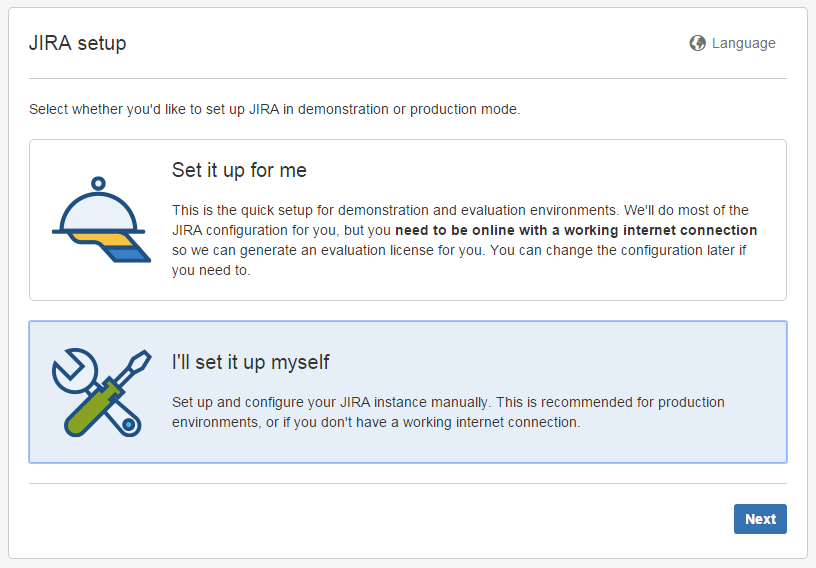
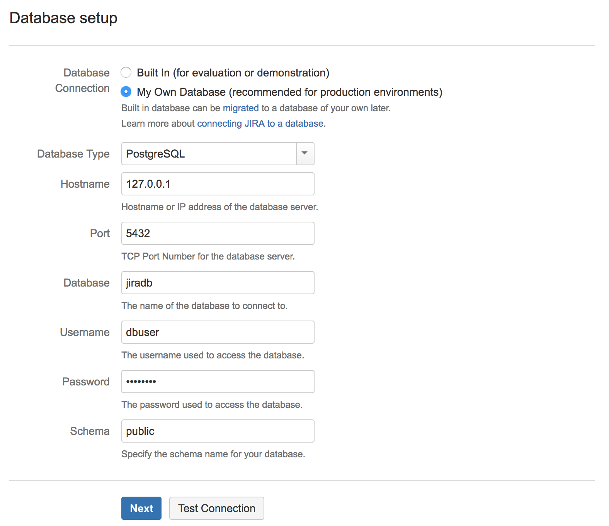

# Jira on Kubernetes

These are my rough notes on how to run a single node Jira server using the built-in H2 database. You MUST understand how Jira works, these are just my notes.

## Overview

- This guide is only showing the high level steps to provision a basic Jira setup
- This is NOT production ready. Do not run Jira like this in production. These are just notes on the basics.

## What makes this work

- 1 Deployment for the Jira server
- Persistent disk for `jira-home` directory

## Usage

### Create a Volume for Persistence 

```
gcloud compute disks create jira-home
```

### Optional: Create a GKE Cluster 
The Jira container requires a minimum of 2 CPU and 2GB memory. The n1-standard-4 image is recommended for your node pool, but any combination that meets that minimum will work without requiring changing the jira-deployment.yaml file.

```
gcloud container clusters create jira-cluster --num-nodes 1 --machine-type n1-standard-4 && gcloud config set container/cluster jira-cluster
``` 

### Optional: Create a Cloud SQL for PostgreSQL Instance
In the same project that you created your GKE cluster, create a new Cloud SQL for PostgreSQL instance. 

Increase the CPU/Memory as needed. Replace [REGION] with the same region used for your GKE cluster. The instance is set to 100GB of SSD and will automatically and permanently increase when it runs out of available space. See the [Cloud SQL]((https://cloud.google.com/sdk/gcloud/reference/sql/instances/create) documentation for additional flags. 

```
gcloud sql instances create jira-data --database-version=POSTGRES_9_6 --cpu=1 --memory=3840MiB --region=[REGION] --maintenance-release-channel=PRODUCTION --storage-size=100GB --storage-type=SSD
```

Set a password for the default user:
```
gcloud sql users set-password postgres no-host --instance=jira-data --password=[PASSWORD]
```

Log into the CloudSQL instance and create a new database:

```
gcloud sql connect jira-data --user=postgres
```

```
CREATE DATABASE jiradb WITH ENCODING 'UNICODE' LC_COLLATE 'C' LC_CTYPE 'C' TEMPLATE template0;
```

### Optional: Create a Cloud SQL Proxy Container
Follow the [documentation](https://cloud.google.com/sql/docs/postgres/connect-container-engine) steps for creating a service account and secrets for your cluster to access Cloud SQL. Make sure you enable the Cloud SQL API!

Use jira-deployment-postgres.yaml for your pod and update the [INSTANCE_CONNECTION_NAME] for the cloudsql-proxy container. The instance connection name should be in the format of project:region:instance-name. For example: myjiradeployment:us-central1:jira-data.

Replace jira-deployment.yaml with jira-deployment-postgres.yaml:
```
mv jira-deployment-postgres.yaml jira-deployment.yaml 
```

### Jira Deployment

```
kubectl create -f jira-deployment.yaml
```

This may take a while! Currently this container is big! Like `873 MB` big. I'll improve that later.

```
kubectl get pods
```
```
NAME                    READY     STATUS              RESTARTS   AGE
jira-3035538708-picc5   0/1       ContainerCreating   0          1m
```

Once the download completes you'll be good to go:

```
$ kubectl get pods
```
```
NAME                    READY     STATUS    RESTARTS   AGE
jira-3035538708-picc5   1/1       Running   0          2m
```

If you deployed the sqlproxy container as well the result is 2/2 containers running:
```
NAME                    READY     STATUS    RESTARTS   AGE
jira-3035538708-picc5   2/2       Running   0          2m
```

### Configure Jira

Access your Jira install using a local port forward. You don't want to get hacked right out of the gate.

```
kubectl port-forward jira-3035538708-picc5 8080:8080
```
```
Forwarding from 127.0.0.1:8080 -> 8080
Forwarding from [::1]:8080 -> 8080
```

Visit http://127.0.0.1:8080 in your browser and complete the initial setup. Choose your setup route depending on if you created the PostgreSQL database or not. See the [Setup Wizard](https://confluence.atlassian.com/adminjiraserver072/running-the-setup-wizard-828787582.html) documentation for further information.

1. Setup with defaults


2. Optional: Manual Jira Configuration with External Database
The Jira container sees the sqlproxy container as localhost so your database is at 127.0.0.1 and a port of 5432. For the example I created a user, dbuser, specifically for the Jira container. Use any instance user with full access to your jira-data database.




### Create an External Service

Once you have Jira all setup you can expose it on the public internet. This setup is not secure so you'll need to do some extra work get HTTPS working.

```
kubectl create -f jira-service.yaml
```

```
service "jira" created
```

```
kubectl get services
```
```
NAME         CLUSTER-IP       EXTERNAL-IP       PORT(S)    AGE
jira         10.215.240.111   XXX.XXX.XXX.XXX   8080/TCP   1m
kubernetes   10.215.240.1     <none>            443/TCP    14d
```

At this point you can visit Jira on http://XXX.XXX.XXX.XXX:8080.
