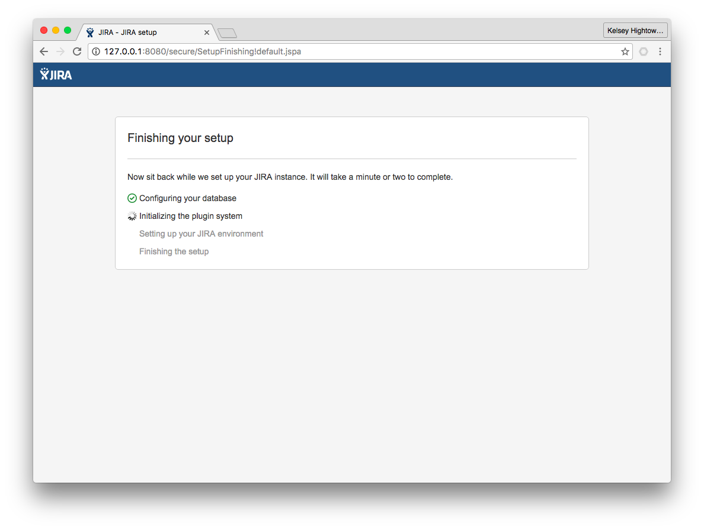

# Jira on Kubernetes

These are my rough notes on how to run a single node Jira server using the built-in H2 database. You MUST understand how Jira works, these are just my notes.

## Overview

- This guide is only showing the high level steps to provision a basic Jira setup
- This is NOT production ready. Do not run Jira like this in production. These are just notes on the basics.

## What makes this work

- 1 Deployment for the Jira server
- Persistent disk for `jira-home` directory

## Usage

### Create a Volume for Persistence 

```
gcloud compute disks create jira-home
```

### Create an External Service

```
kubectl create -f jira-service.yaml
```

```
service "jira" created
```

```
kubectl get services
```
```
NAME         CLUSTER-IP       EXTERNAL-IP       PORT(S)    AGE
jira         10.215.240.111   XXX.XXX.XXX.XXX   8080/TCP   1m
kubernetes   10.215.240.1     <none>            443/TCP    14d
```

### Jira Deployment

```
kubectl create -f jira-deployment.yaml
```

This may take a while! Currently this container is huge! Like `1.972 GB` huge. I'll fix that later.

```
kubectl get pods
```
```
NAME                    READY     STATUS              RESTARTS   AGE
jira-3035538708-picc5   0/1       ContainerCreating   0          1m
```

Once the download completes you'll be good to go:

```
$ kubectl get pods
```
```
NAME                    READY     STATUS    RESTARTS   AGE
jira-3035538708-picc5   1/1       Running   0          2m
```

### Configure Jira

Access you Jira install using a local port forward. You don't want to get hacked right out of the gate.

```
kubectl port-forward jira-3035538708-picc5 8080:8080
```
```
Forwarding from 127.0.0.1:8080 -> 8080
Forwarding from [::1]:8080 -> 8080
```

Visit http://127.0.0.1:8080 in your browser and complete the initial setup.




